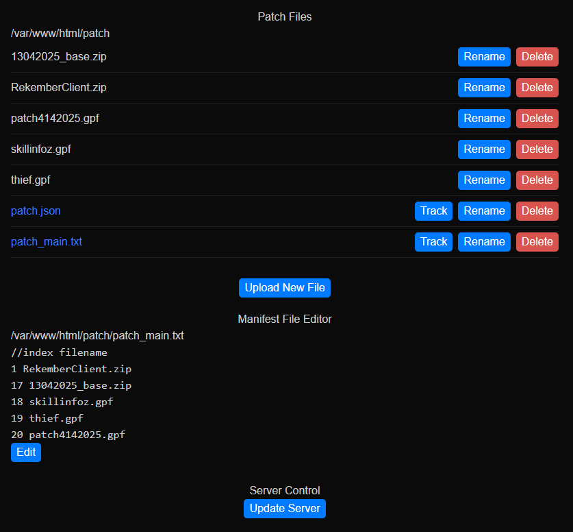

## Simple Remote File Manger
A simple web application to manage remote files and edit manifest file for Eluair Patcher.
Handles basic login auth, file upload, file rename, file delete, file tracking for the manifest file and manual editing the manifest file.

## Installation
Create your .env file in the project repo. Example file:
```.env
NEXTAUTH_SECRET=[Secret Key]
NEXTAUTH_URL=http://localhost:3000
NEXT_API_KEY=[Secret Api Key]
DUMMY_USER_USERNAME=admin
DUMMY_USER_PASSWORD=passoword
NEXT_PUBLIC_ROOT=/var/www/html
NEXT_PUBLIC_MANIFEST=manifest.txt
NEXT_SERVER_PATH=[Local rAthena Repositiory]
NEXT_PUBLIC_MAXFILESIZE=100
```

Run the project in dev mode (or build for production)
```bash
npm run dev
# or
yarn dev
# or
pnpm dev
# or
bun dev
```

## Usage
Open the app by entering your hostname/address into your web browser of choice.
Quickly and easily way to upload and manage files for your Eluair Patcher.
For technicalities on how the Eluair Patcher works, check out their documentation here http://elurair.com/

## Preview

